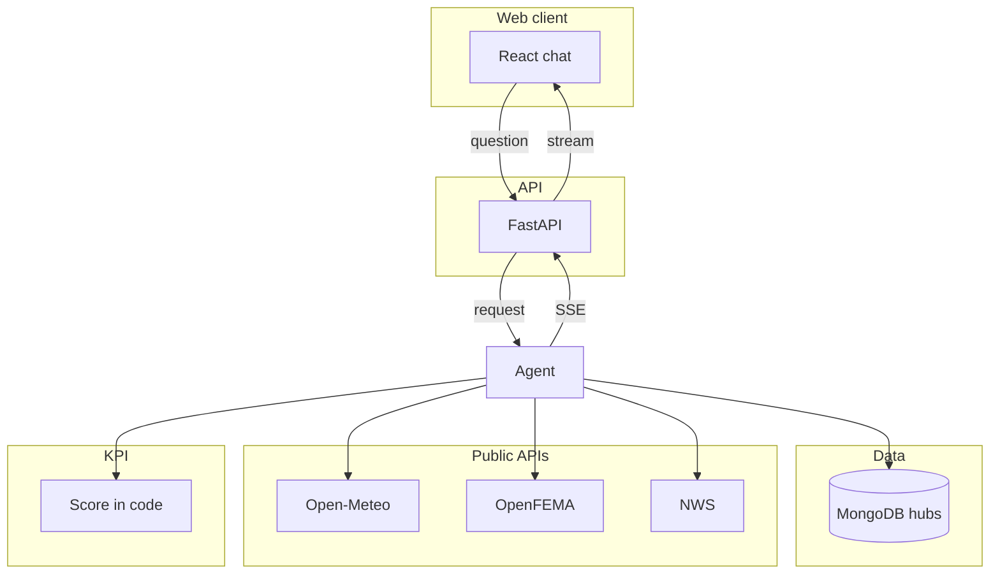
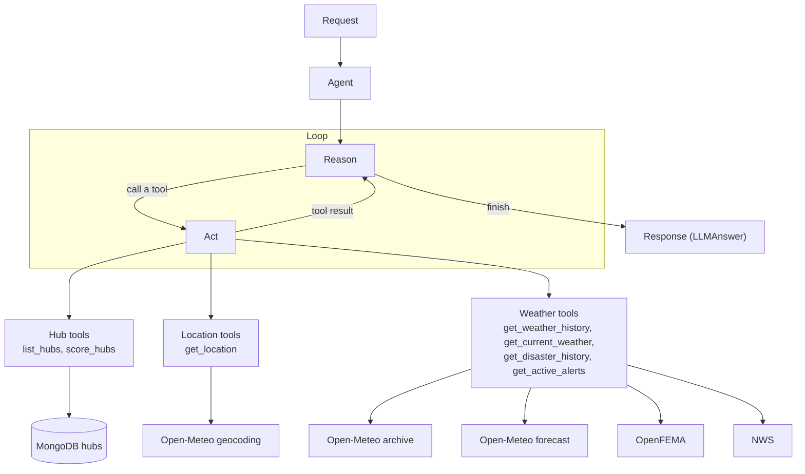

# Architecture

        

Analysts use a React chat. The chat calls one FastAPI service. That service runs an agent with read-only tools. Tools read the `hubs` collection and, when a question needs it, public weather and hazard APIs. Ranking uses a score computed in code, not by the model. The model explains the result. Follow-up turns stay on one in-memory thread.

## Structure



## Agent

The package map is [`server/agent/structure.md`](../server/agent/structure.md). The agent (`OllamaAgent` via LangChain `create_agent`, or `FakeAgent` in tests) is a ReAct loop. A request enters the agent. Reason decides the next step. If a fact is missing, Act runs one tool group and the result returns to Reason. That loop repeats until Reason finishes. The finish is `Response (LLMAnswer)`: the model returns only `answer`, and code fills `timestamp`, `model`, and `prompt` into `Answer`. A plain-text final reply is accepted when it validates as `LLMAnswer`. A call-limit failure is an `error` event, not an answer.

Hub tools read the `hubs` collection. `score_hubs` also writes a fresh score back to that collection. `set_hub` is defined and is not registered. Location tools and weather tools call a public API and do not touch the database.



## Components

**Web client** (`weather-app`). `App.tsx` holds the session and the composer. The screen is `Header`, `ChatDisplay`, `SuggestionsDisplay`, `MessageCard`, `HubsDropUp`, and `VoiceInput`. Suggestions appear only on an empty chat that has hubs. The hub picker keeps the chosen hub and does not write it into the input. An empty send is ignored. If the typed text does not name the chosen hub, that hub is added to the question. Voice writes English words into the box as they are heard, sends after a pause of about ten seconds, and a click while listening stops without sending.

```
services/api.ts    GET /api/hubs, POST /api/agent/stream
services/chat.ts   stream event -> tool step on the assistant card
```

**API** (`server/server.py`, `server/routes/agent_routes.py`). The router is mounted at `/api`. The running process uses `Agent(is_fake=False)`.

```
GET  /                  API name, or the built chat when the image includes it
GET  /json/version      API name
GET  /api/health        health check
GET  /api/hubs          hub list from the collection
GET  /api/agent         one-shot reply
POST /api/agent/stream  Server-Sent Events for one turn
```

```
tool_call
tool_result
answer
error
done
```

## Repository structure

```
server/
  server.py                 process entry, dotenv, FastAPI
  routes/agent_routes.py    HTTP and the SSE stream
  agent/structure.md        package map
  agent/agent.py            wrapper. is_fake selects the provider
  agent/providers/          Ollama agent, fake agent, base type
  agent/prompts/            system, tool, and boundary text
  agent/tools/              list_hubs, score_hubs, location, weather
  agent/scoring/            ScoreMethod and factor weights
  agent/schema/             LLMAnswer, Answer, and tool results
  data/                     MongoDB manager and hub seed
  eval/                     cases, grader, runner
  tests/                    unit tests and run.py (see docs/test.md)
    agent/
    data/
    eval/
    prompts/
    scoring/
    tools/
weather-app/
  src/App.tsx
  src/components/
  src/services/
  src/types/
docs/
  requirements.md
  architecture.md
  test.md
  conversations/        agent sessions, oldest first
Dockerfile                  API image, listens on port 8000
docker-compose.yaml         runs the API and reads server/.env
```

## Containers

`Dockerfile` builds the React app, then a Python image that runs `python server.py` with `HOST=0.0.0.0` and `PORT=8000`. That image serves the built chat at `/` and the API under `/api`. `docker-compose.yaml` publishes that port and loads `server/.env`. `npm run dev` in `weather-app/` is the local chat. A `BASE_URL` or `MONGODB_URI` that points at `127.0.0.1` is the container itself, so Ollama or MongoDB on the host must use `host.docker.internal`.

## Data storage

MongoDB (`server/data/manager.py`). One collection, `hubs`, one document per hub. The agent does not add or update hubs. It calls `get_location` only when `list_hubs` did not already return coordinates, then calls a weather or hazard tool only for the sections a question needs. Each of those tools takes a list and fetches every place in that one call.

```
city
city_key          unique, lowercase
state_code
region
county            optional override
location          latitude, longitude, county
created_at
score             written by score_hubs
scored_at
```

## Scoring

`ScoreMethod.score_hub` in `agent/scoring/score.py` turns weather, FEMA history, and active alerts into a 0-100 `RiskScore`. A section that failed is omitted and the remaining weights are scaled to 100. `score_hubs` calls it when a question ranks or compares hubs. A score older than one day is recalculated. A newer score is reused.

```
weather    50    snow, freezing, heavy rain, high wind
disasters  40
alerts     10
```

## Session

The Ollama agent stores each chat in process memory (`InMemorySaver`), keyed by `thread_id`. A later request with the same id continues that chat and adds only the new message. A thread with nothing saved yet uses the message list on the request. The memory is gone when the server process stops.

## Assumptions

- The company is inferred to have multiple distribution hubs, and those hubs are the focus. The agent does not inquire about other places in the US or worldwide.
- Registered tools are read-only:

```
list_hubs
score_hubs
get_location
get_weather_history
get_disaster_history
get_active_alerts
get_current_weather
```

- A weather question may call tools. A general question, such as how the score works or a greeting, is answered without a tool.
- A question about technologies, or a request to add, update, or remove hubs, is answered by the model in one or two friendly sentences, with no tool call and no list of tool names.
- A city that is not a hub is named as such, with the hubs in that region, and no data is fetched for it.
- When the image includes the built chat, `GET /` serves that client. `GET /json/version` returns the API name. Without the built chat, `GET /` returns the API name so that probe is not 404.
- Weather answers name a fact once, and mention total snowfall only when the user asks how much snow fell.
- If the hub or the hazard is missing, the reply is one follow-up question and does not describe what data is available.
- A question that names no hub does not call a tool, including `list_hubs`, and asks which hub.

## Evaluation

`server/eval/cases.py` holds a small set of questions. From `server/`, the runner sends each turn to the Ollama agent on one in-memory thread and grades the streamed tools and answer text (`server/eval/check.py`). A name argument runs only the matching cases. The process exits with status 1 when any case fails.

```
python -m eval.run
```
