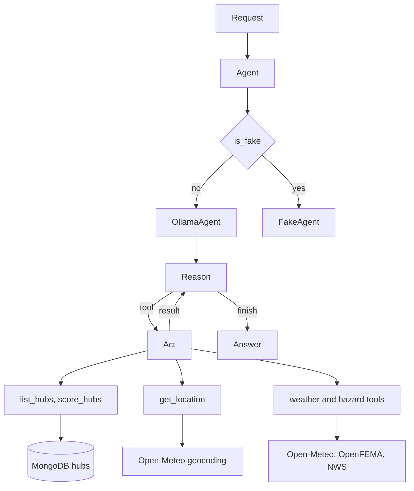

# Agent

   

`server/agent` is the package the API calls. `Agent` selects `OllamaAgent` or, in tests, `FakeAgent`. The Ollama agent is a LangChain ReAct loop. Registered tools are read-only. The model returns `LLMAnswer` (`answer` only). Code fills `timestamp`, `model`, and `prompt` into `Answer`.

## Files

```
agent.py                         wrapper. is_fake selects the provider
providers/base_agent.py          get_response and stream
providers/ollama_agent.py        ChatOllama, create_agent, InMemorySaver, call limit
providers/fake_agent.py          stand-in used when is_fake is true
prompts/ollama_system_prompt.py  role, tools, and boundaries
prompts/tool_prompt.py           each tool as name, input, and output
prompts/boundaries_prompt.py     weather, general, and out of scope
tools/hub_tools.py               list_hubs, score_hubs
tools/location_tools.py          get_location
tools/weather_tools.py           history, current weather, disasters, alerts
tools/db_tools.py                find and update helpers for the hubs collection
scoring/score.py                 ScoreMethod.score_hub
scoring/factors.py               weather 50, disasters 40, alerts 10
schema/answer.py                 LLMAnswer and Answer
schema/tool_results.py           Hub, HubScore, and tool result types
```

`HubTools.set_hub` is defined and is not registered. `get_tools` returns `list_hubs` and `score_hubs` only.

## Request

`Agent.stream` turns the chat list into LangChain messages and calls the provider. `OllamaAgent` keeps one `InMemorySaver` thread per `thread_id`. A thread that already has turns receives only the new message.

The system prompt is `SYSTEM_PROMPT`: the role line, `TOOL_PROMPT`, and `BOUNDARIES_PROMPT`. The loop may call a tool, then reason again, until the model finishes or `RUN_LIMIT` stops it. A plain-text finish is kept when it validates as `LLMAnswer`. A call-limit stop is an error, not an answer.



## Tools

| Tool | File | Reads |
| --- | --- | --- |
| `list_hubs` | `tools/hub_tools.py` | `hubs` collection |
| `score_hubs` | `tools/hub_tools.py` | collection; a stale score is written through `set_hub` |
| `get_location` | `tools/location_tools.py` | Open-Meteo geocoding |
| `get_weather_history` | `tools/weather_tools.py` | Open-Meteo archive |
| `get_current_weather` | `tools/weather_tools.py` | Open-Meteo forecast |
| `get_disaster_history` | `tools/weather_tools.py` | OpenFEMA |
| `get_active_alerts` | `tools/weather_tools.py` | National Weather Service |

`list_hubs` and `score_hubs` are the hub tools. `get_location` is the location tool. The four weather and hazard calls are the weather tools. Each of those five takes a list and returns one result per place, in order. A failed place is a `ToolError` in that position.

`score_hubs` calls `ScoreMethod.score_hub`. Seeded scores start at 0 with no `scored_at`, so the first scoring run always recalculates them. A missing timestamp, a score with no factor points, or a stored score older than one day, is saved with `set_hub`, which sets `score`, the factor points, and `scored_at`. A current score that already has factor points is reused. A changed number is a `score_alert` for the chat. Weather is 50 (snow, freezing, heavy rain, high wind), FEMA disasters are 40, and active alerts are 10. A missing section is dropped and the remaining weights are scaled to 100.

The system view is [docs/architecture.md](../../docs/architecture.md). The agent sessions are [docs/conversations](../../docs/conversations/README.md).
